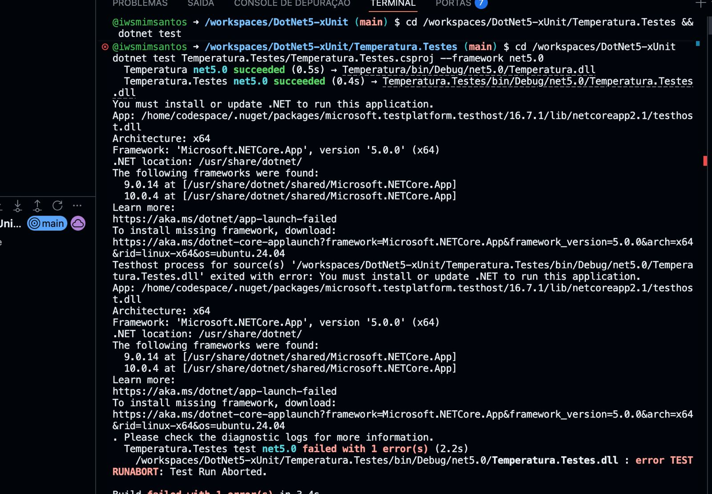
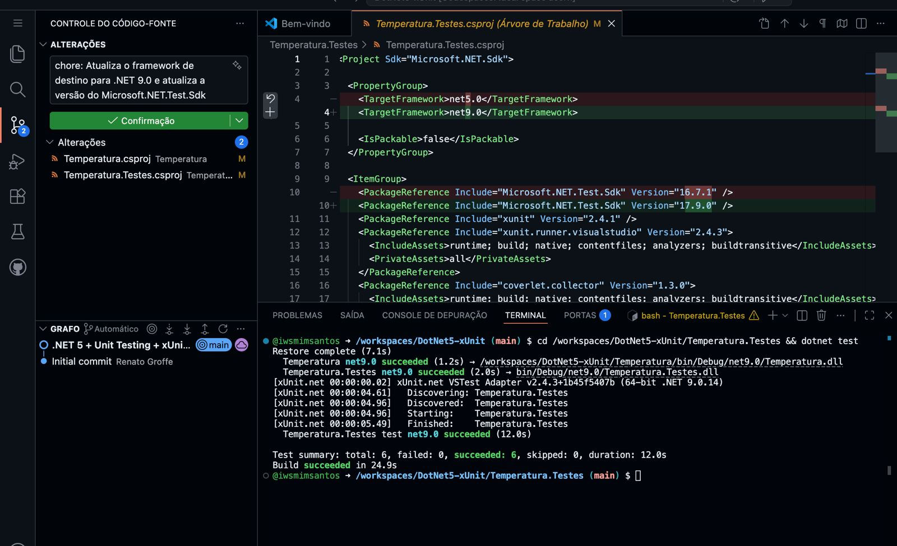
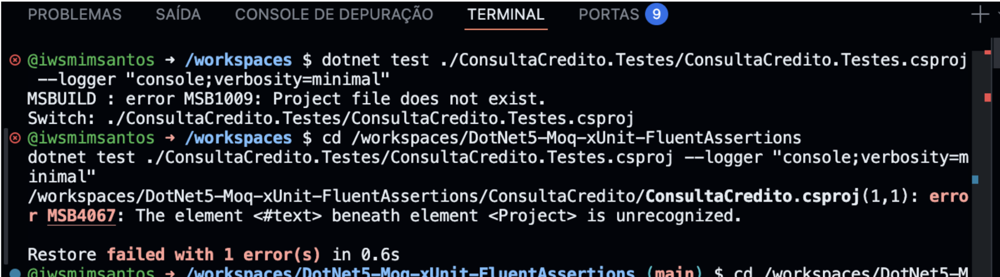
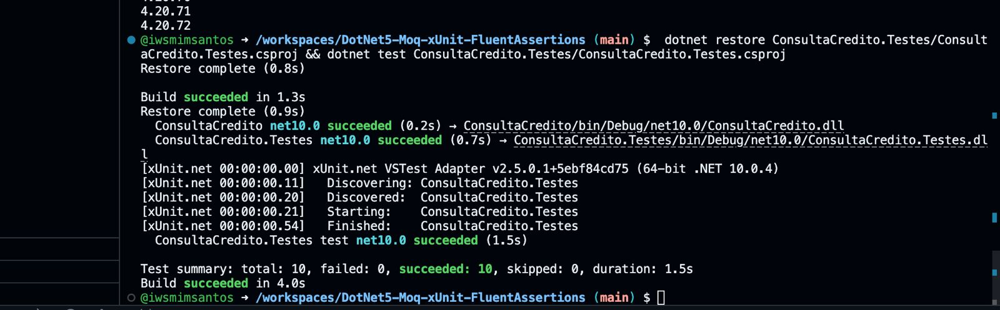
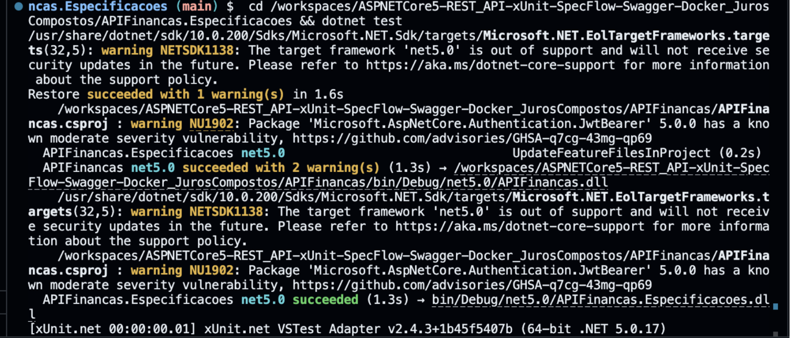
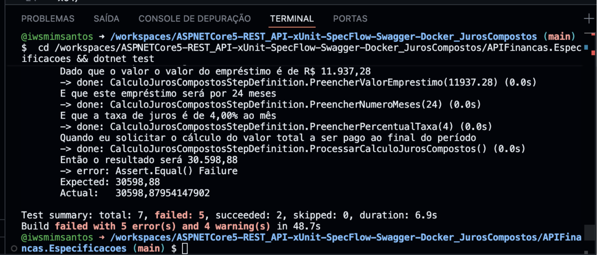
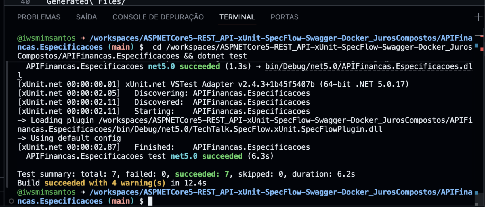

# 1. Repositório 1 — Conversor de Temperatura

Projeto com uma biblioteca simples para conversão de Fahrenheit para Celsius utilizando xUnit para validação automatizada.

O objetivo do projeto foi validar o funcionamento da conversão de temperatura por meio de testes automatizados, além de resolver problemas de compatibilidade do ambiente .NET.

## Objetivo

Garantir que os cálculos de conversão de temperatura sejam executados corretamente e demonstrar a aplicação de testes automatizados em .NET.

---

## Como executar os testes

Execute o comando abaixo:

```bash
dotnet test Temperatura.Testes/Temperatura.Testes.csproj --framework net9.0
```

---

## Testes Unitários

### Aplicação

Os testes unitários foram utilizados para validar a lógica isolada da função responsável pela conversão de Fahrenheit para Celsius, garantindo que o cálculo matemático seja executado corretamente sem depender de bibliotecas externas, APIs ou banco de dados.

### Quando usar

São indicados para validar regras de negócio, fórmulas matemáticas e comportamentos isolados do sistema.

### Cenários de exemplo

#### Cenário 1

**Entrada:** `32°F`

**Resultado esperado:** `0°C`

#### Cenário 2

**Entrada:** `212°F`

**Resultado esperado:** `100°C`

### Evidência da execução

```text
Test summary: total: 6, failed: 0, succeeded: 6, skipped: 0, duration: 12.0s
Build succeeded in 24.9s
```

### Print da execução

#### Erro inicial do ambiente (.NET 5 não encontrado)



O primeiro problema encontrado ocorreu porque o ambiente do Codespaces não possuía o runtime do `.NET 5.0`, impedindo a execução dos testes.

#### Sucesso após correção do framework



Após a atualização do `TargetFramework` para `.NET 9.0` e da versão do `Microsoft.NET.Test.Sdk`, os testes passaram a executar corretamente.

---

## Problema encontrado

### Problema — Runtime do .NET 5 indisponível

#### Erro encontrado

```text
You must install or update .NET to run this application.
Framework: 'Microsoft.NETCore.App', version '5.0.0'
```

#### Causa

O projeto estava configurado para utilizar `.NET 5.0`, porém o ambiente possuía apenas as versões `.NET 9` e `.NET 10` instaladas.

#### Correção aplicada

Foi realizada a atualização do framework e do SDK de testes:

```xml
<TargetFramework>net9.0</TargetFramework>
```

Também foi atualizada a dependência:

```xml
<PackageReference Include="Microsoft.NET.Test.Sdk" Version="17.9.0" />
```

Após a alteração, os testes executaram normalmente.

---

# 2. Repositório 2 — Consulta de Crédito (xUnit + Moq + FluentAssertions)

Projeto desenvolvido para demonstrar testes automatizados em .NET utilizando `xUnit`, `Moq` e `FluentAssertions` em cenários de análise de crédito.

O objetivo do projeto foi validar regras de negócio relacionadas à aprovação de crédito, além de resolver problemas de configuração e compatibilidade do ambiente .NET.

## Objetivo

Garantir o correto funcionamento das regras de aprovação de crédito e demonstrar a aplicação de testes automatizados em aplicações .NET.

---

## Como executar os testes

Execute o comando abaixo na raiz do repositório:

```bash
dotnet test ./ConsultaCredito.Testes/ConsultaCredito.Testes.csproj --logger "console;verbosity=minimal"
```

---

# Testes Unitários

## Aplicação

Os testes unitários foram utilizados para validar regras isoladas de negócio relacionadas ao processo de consulta de crédito, sem dependência de serviços externos ou banco de dados.

## Quando usar

São indicados para validar regras de negócio, validações de entrada, cálculos e comportamentos internos do sistema.

## Cenários de exemplo

### Cenário 1

**Entrada:** cliente com renda mensal de `R$ 5.000,00` e baixo comprometimento financeiro.

**Resultado esperado:** crédito `Aprovado`.

### Cenário 2

**Entrada:** CPF inválido ou mal formatado.

**Resultado esperado:** falha de validação ou exceção controlada.

## Evidência da execução

```text
Restore complete (0.8s)
ConsultaCredito net10.0 succeeded
ConsultaCredito.Testes net10.0 succeeded
Passed! - Failed: 0, Passed: 10, Skipped: 0, Total: 10
Test summary: total: 10, failed: 0, succeeded: 10, skipped: 0
```

## Print da execução

### Erro inicial — caminho incorreto e `.csproj` inválido



### Execução dos testes com sucesso



---

# Testes de Integração

## Aplicação

Os testes de integração foram utilizados para validar o funcionamento conjunto entre serviços, regras de negócio e repositórios da aplicação.

## Quando usar

São indicados para verificar se diferentes componentes do sistema funcionam corretamente em conjunto.

## Cenários de exemplo

### Cenário 1

Integração entre o serviço de consulta de crédito e o repositório responsável pelo armazenamento da análise.

**Resultado esperado:** os dados salvos devem ser recuperados corretamente.

### Cenário 2

Fluxo de consulta de score externo utilizando test doubles.

**Resultado esperado:** a decisão final deve respeitar as regras de negócio implementadas.

## Evidência da execução

```text
Passed! - Failed: 0, Passed: 10, Skipped: 0, Total: 10, Duration: 1.5s
Test summary: total: 10, failed: 0, succeeded: 10, skipped: 0
```

## Print da execução

### Warning encontrado



### Execução dos testes de integração


---

# Testes de Aceitação

## Aplicação

Os testes de aceitação foram utilizados para validar o comportamento do sistema sob a perspectiva do usuário final, verificando fluxos completos de análise de crédito.

## Quando usar

São indicados para validar requisitos funcionais e garantir que o sistema entregue o comportamento esperado ao usuário.

## Cenários de exemplo

### Cenário 1

Cliente solicita análise de crédito com dados válidos.

**Resultado esperado:** crédito `Aprovado` com limite calculado corretamente.

### Cenário 2

Cliente com histórico financeiro irregular solicita crédito.

**Resultado esperado:** crédito `Rejeitado`.

## Evidência da execução

```text
Passed! - Failed: 0, Passed: 10, Skipped: 0, Total: 10, Duration: 1.5s
Test summary: total: 10, failed: 0, succeeded: 10, skipped: 0
```

## Print da execução


---

# Problemas encontrados

Durante o desenvolvimento foram identificados problemas relacionados à estrutura do projeto e compatibilidade de dependências.

## Problema 1 — Caminho incorreto do projeto

### Erro encontrado

```text
MSB1009: Project file does not exist.
```

### Causa

O comando `dotnet test` foi executado fora da raiz correta do projeto.

### Correção aplicada

Execução do comando utilizando o caminho correto do `.csproj`.


---

## Problema 2 — Arquivo `.csproj` inválido

### Erro encontrado

```text
MSB4067: The element <#text> beneath element <Project> is unrecognized.
```

### Causa

Texto inválido foi inserido acidentalmente dentro do arquivo `.csproj`.

### Correção aplicada

Remoção do conteúdo inválido e restauração da estrutura XML correta.


---

## Problema 3 — Warnings de compatibilidade e vulnerabilidade

### Warning encontrado

```text
warning NETSDK1138: The target framework 'net5.0' is out of support
warning NU1902: Package 'Microsoft.AspNetCore.Authentication.JwtBearer' 5.0.0 has a known moderate severity vulnerability
```

### Causa

O projeto utilizava `.NET 5.0`, atualmente fora de suporte, além de dependências com vulnerabilidades conhecidas.

### Correção aplicada

Atualização e validação das dependências utilizadas no projeto.


# 3. Repositório 3 — API de Juros Compostos (xUnit + SpecFlow + Swagger + Docker)

Projeto desenvolvido para cálculo de juros compostos utilizando ASP.NET Core, testes automatizados com `xUnit` e `SpecFlow`, além de integração com Swagger e Docker.

O objetivo do projeto foi validar cenários automatizados de cálculo financeiro e resolver problemas relacionados à precisão decimal durante a execução dos testes.

## Objetivo

Garantir que os cálculos de juros compostos sejam executados corretamente e demonstrar a aplicação de testes automatizados em APIs .NET.

---

## Como executar os testes

Execute o comando abaixo:

```bash
cd APIFinancas.Especificacoes && dotnet test
```

---

# Testes Unitários

## Aplicação

Os testes unitários foram utilizados para validar o cálculo isolado de juros compostos, garantindo que os valores retornados estejam corretos conforme as regras financeiras definidas.

## Quando usar

São indicados para validar fórmulas matemáticas, cálculos financeiros e comportamentos isolados do sistema.

## Cenários de exemplo

### Cenário 1

**Entrada:** empréstimo de `R$ 10.000,00`, prazo de `12 meses` e taxa de `2% ao mês`.

**Resultado esperado:** valor total calculado corretamente ao final do período.

### Cenário 2

**Entrada:** empréstimo de `R$ 11.937,28`, prazo de `24 meses` e taxa de `4% ao mês`.

**Resultado esperado:** valor final arredondado corretamente para duas casas decimais.

## Evidência da execução

```text
APIFinancas.Especificacoes test net5.0 succeeded (6.3s)
Test summary: total: 7, failed: 0, succeeded: 7, skipped: 0, duration: 6.2s
Build succeeded with 4 warning(s) in 12.4s
```

## Print da execução

### Falha inicial nos testes por diferença de precisão decimal



### Execução dos testes com sucesso



---

# Testes de Integração

## Aplicação

Os testes de integração foram utilizados para validar o funcionamento conjunto entre API, regras de negócio e cenários automatizados definidos no SpecFlow.

## Quando usar

São indicados para verificar se diferentes partes da aplicação funcionam corretamente em conjunto.

## Cenários de exemplo

### Cenário 1

Execução do cálculo de juros compostos através do fluxo completo da API.

**Resultado esperado:** retorno correto do valor calculado.

### Cenário 2

Integração entre os cenários BDD do SpecFlow e os métodos da API.

**Resultado esperado:** todos os steps executados corretamente.

## Evidência da execução

```text
[xUnit.net 00:00:02.11] Starting: APIFinancas.Especificacoes
-> Loading plugin TechTalk.SpecFlow.xUnit.SpecFlowPlugin.dll
[xUnit.net 00:00:02.87] Finished: APIFinancas.Especificacoes
APIFinancas.Especificacoes test net5.0 succeeded (6.3s)
```

## Print da execução


---

# Testes de Aceitação

## Aplicação

Os testes de aceitação foram utilizados para validar o comportamento completo da API sob a perspectiva do usuário final.

## Quando usar

São indicados para validar requisitos funcionais e garantir que o sistema entregue o comportamento esperado em fluxos completos.

## Cenários de exemplo

### Cenário 1

Usuário solicita o cálculo de juros compostos com dados válidos.

**Resultado esperado:** valor final calculado corretamente.

### Cenário 2

Usuário informa valores que exigem arredondamento decimal.

**Resultado esperado:** resultado arredondado corretamente para duas casas decimais.

## Evidência da execução

```text
Test summary: total: 7, failed: 0, succeeded: 7, skipped: 0, duration: 6.2s
Build succeeded with 4 warning(s) in 12.4s
```

## Print da execução


---

# Problemas encontrados

Durante o desenvolvimento foram identificados problemas relacionados à precisão decimal nos cálculos financeiros.

## Problema — Diferença de precisão decimal

### Erro encontrado

```text
Assert.Equal() Failure
Expected: 30598,88
Actual:   30598,87954147902
```

### Causa

O cálculo retornava valores com precisão decimal extensa sem arredondamento adequado antes da validação dos testes.

### Correção aplicada

Aplicação de arredondamento apropriado para duas casas decimais antes da comparação dos valores esperados.


